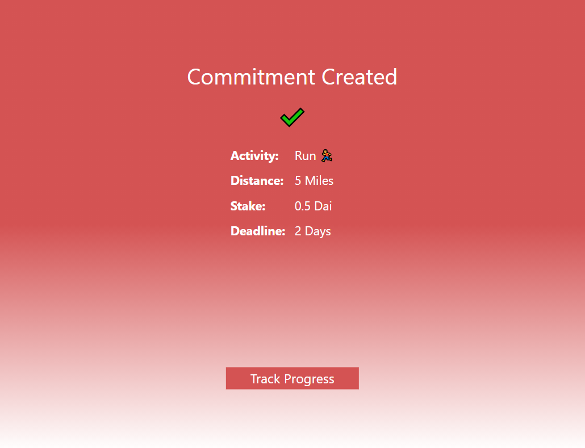

# CommitPool on Matic

## Latest Update (March 13, 2021): We are currently on Rinkeby for testing purposes (contract verification, etc.). We will be back on Matic soon, but please note that, while we're on Rinkeby, our app takes Rinkeby Eth and Link (Dummy Dai).

## Overview

CommitPool helps you **hold yourself accountable** to your personal goals.

Typically, the only accountability tools we can use to stick to our personal goals are our willpower and sense of self-worth. Other tools like monetary penalities and reputation can be more powerful, but they don't work well unless somebody else implements them on us, which introduces trusted intermediaries and counterparty risk.

By minimizing that counterparty risk with smart contracts and decentralized oracles, CommitPool enables you to enforce monetary penalties _on yourself_.

### How to use CommitPool

1. Open the [app](https://app.commitpool.com/)
2. Connect your Strava Account
3. Fund your in-app wallet with Rinkeby Ether from a [Rinkeby Faucet](http://rinkeby-faucet.com/), and LINK (Dummy Dai -- used wherever the app asks for DAI) from the [Chainlink Faucet](https://rinkeby.chain.link/)
4. Commit and stake! We recommend keeping your commitment amounts low for testing purposes (.1 Eth/Dai or so) so you don't have to keep refilling at a faucet
5. Hit your goal
6. Profit?

## How we built it

CommitPool users register commitments with our [smart contract](./CommitPoolContract). Those commitments include an activity (biking or running), a time period (e.g. 2 days), a distance goal (e.g. 5 miles), and a stake amount (e.g. 5 DAI).

We use Chainlink to bring their activity distance data on-chain, where our contract checks whether they met their distance goal. If so, they get their stake back; but if not, their stake gets slashed.

The Matic Network's speed and low transaction fees are crucial to create a viable user experience for CommitPool. Higher tx fees would eat significantly into the amounts we expect most users to be staking on their commitments.

For this hackathon, behind the scenes, we're using the LINK token for commitment staking as our test ERC20 token. Once we launch on Matic mainnet, we'll use DAI, so our app still labels it "DAI."

We built a [web app](./CommitPoolApp) for users to create a commitment, track their progress against their goal, and withdraw their stake (if they fulfilled their commitment). Since our current focus is on fitness goals, our original vision was to build a mobile app, so we're using React Native with Metro to support a web app with the same code base.

Our app spins up an in-browser wallet for users using the [TasitSDK](https://github.com/tasitlabs/tasit-sdk).

## Where we ran into challenges

-   Verifying our contract on the Mumbai block explorer - we were able to verify on Etherscan for a Ropsten test deployment (using the Hard Hat plugin), but couldn't get it to work on the BlockVigil explorer.
-   Mumbai RPC / node rate limiting our Chainlink node - for this hackathon we're running a single Chainlink node as our oracle service, but it kept getting rate limited by the Block Vigil RPC service, even when we were upgraded to the Growth plan.
-   Getting test ERC20 tokens (e.g. Matic DAI or even TEST) was difficult. The supply of TEST tokens in the faucet was low/zero. We ended up using LINK for this purpose.

## What we want to do next

-   Refine the UX so that creating a commitment is even smoother/clearer
-   Support metatransactions
-   Extend our app to support mobile
-   Support users' existing wallets (e.g. on mobile via mobile WalletConnect)
-   Update our contract to enable positive rewards (i.e. slashed stakes get distributed to users who meet their commitment).
-   Cover the LINK oracle fee for users
-   Add additional types of commitments (e.g. additional Strava activity types, Duolingo commitments, etc.)

## References

-   The CommitPool smart contract on Mumbai: [0x251B6f95F6A17D2aa350456f616a84b733380eBE](https://explorer-mumbai.maticvigil.com/address/0x251B6f95F6A17D2aa350456f616a84b733380eBE/transactions)
-   The CommitPool [web app](https://festive-shannon-3a302b.netlify.app/)
-   Our [hackathon repo](https://github.com/CommitPool/CommitPoolMatic)
-   Hackathon [demo video](https://youtu.be/PAQ8dHWHwjQ)
